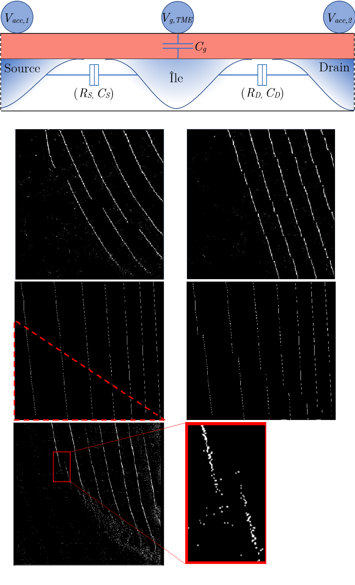

# Quantum-dots-simulator-and-image-processing-toolbox
Here is an implementation of a one dimensional quantum dots simulator and images processing toolbox. The purpose of this code is the fast simulation of stability diagrams, containing commons experimentals and quantum behaviors, that can be used for the creation of artificial intelligence training datasets.

## Prerequisites
- Matlab >= R2017a (https://www.mathworks.com/)
- MathWorks Image Processing Toolbox (https://www.mathworks.com/products/image.html)

## Citation
If you use this code for your research, please my thesis.
@mastersthesis{QD_simulation_image_processing,
  author       = {Marc-Antoine Genest}, 
  title        = {Implémentation d'une méthode d'identification de l'occupation électronique d'une boîte quantique grâce à des techniques d'apprentissage profond},
  school       = {Université de Sherbrooke},
  year         = 2020,
  month        = 1,
}

## Help
- simu_main.m : manually editate this file to simulate a new device and create different image process. Most functions used by this code are located in \simulation_toolbox folder.
- image_process.m : function called by simu_main.py that manages and calls images processing functions located in \image_processing_toolbox folder
- random_process_generator.m : example of a function used to create multiple random process (usefull in data augmentation for artificial intelligence algorithms) given a simulation structure saved by simu_main.m
- get/write_integral_tab : used to accelerate to calculation of the Fermi-Dirac integral (pre-calculate a table and search in a list was faster in my case than an analytic function using 32-64 bit integers)

## License
The source code of this project is licensed under the [License Zero Prosperity Public License](https://prosperitylicense.com/) (see LICENSE.md).